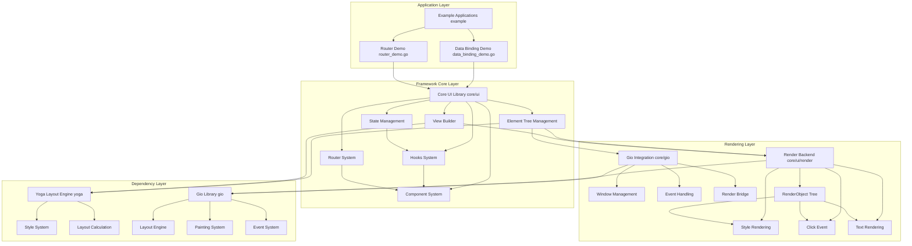

# Tenon - React-like UI Framework for Go

Tenon is a React-like UI framework for Go, combining React's component-based approach with Gio's high-performance rendering, using Yoga layout engine for flexible styling, providing modern UI development experience for Go developers.

[📖 中文版本](README.zh-CN.md) | [🏠 Homepage](https://github.com/sjm1327605995/tenon)

## 📋 Core Features

- **React-like Component System**: Supports functional components and Hooks
- **Declarative UI**: Build views using chained API
- **Yoga Layout Engine**: Supports Flexbox and Grid layouts
- **State Management**: Built-in `useState` Hook for component state management
- **Router System**: Multi-page application support
- **Gio Rendering**: High-performance rendering based on Gio library
- **Event Handling**: Support for click and other user interactions

## 🏗️ Architecture Design



## 🚀 Quick Start

### Installation

```bash
go get github.com/sjm1327605995/tenon
```

### Running Examples

```bash
# Run data binding example
go run example/data_binding_demo.go

# Run router example
go run example/router_demo.go
```

## 📚 Core Features

### 1. Component System

```go
// Define component props
type CounterProps struct {
    InitialCount int
}

// Create functional component
func Counter(props CounterProps) ui.UI {
    // Use useState Hook
    count, setCount := ui.UseState(props.InitialCount)
    
    return ui.View(
        ui.Text().Content(fmt.Sprintf("Count: %d", count)),
        ui.View(
            ui.Text().Content("+"),
        ).Background(color.NRGBA{G: 255, A: 255}).OnClick(func() {
            setCount(count + 1)
        }),
    )
}
```

### 2. Hooks System

- `useState`: Manage component state
- `useNavigate`: Implement programmatic navigation

### 3. Router System

```go
// Define routes
routes := []ui.RouteProps{
    {Path: "/", Component: Counter, Props: CounterProps{InitialCount: 0}},
    {Path: "/about", Component: AboutPage, Props: AboutPageProps{}},
}

// Create router
router := ui.NewRouter(routes)
```

### 4. View Construction

```go
// Build view using chained API
view := ui.View(
    ui.Text().Content("Hello, Tenon!").FontSize(24),
    ui.View(
        ui.Text().Content("Subview 1"),
        ui.Text().Content("Subview 2"),
    ).FlexDirection(yoga.FlexDirectionRow),
).
    Width(ui.Percent(100)).
    Height(ui.Percent(100)).
    Background(color.NRGBA{B: 255, A: 128})
```

## 📁 Project Structure

```
tenon/
├── core/
│   ├── gio/          # Gio integration
│   │   └── app.go    # Application startup and window management
│   └── ui/           # Core UI library
│       ├── binding.go # Components and Hooks system
│       ├── element.go # Element tree management
│       ├── ui.go      # View construction API
│       └── render/    # Render backend
│           ├── click_able.go  # Click event handling
│           ├── render.go       # Render base class
│           ├── text.go         # Text rendering
│           └── tree.go         # RenderObject tree
├── example/          # Example applications
│   └── data_binding_demo.go # Data binding example
└── yoga/             # Yoga layout engine
    ├── enum.go       # Enum definitions
    └── style.go      # Style system
```

## 📖 Usage Guide

### Creating Components

1. Define component props structure
2. Create functional component that receives props and returns UI
3. Use Hooks to manage state inside components
4. Build views using chained API

### Using Hooks

```go
// State management
count, setCount := ui.UseState(0)

// Navigation
navigate := ui.UseNavigate()
navigate("/about")
```

### Configuring Routes

1. Define route configuration, mapping paths to components
2. Create router manager
3. Use `useNavigate` in components for programmatic navigation

## 🤝 Contribution Guide

1. Fork this repository
2. Create feature branch (`git checkout -b feature/AmazingFeature`)
3. Commit changes (`git commit -m 'Add some AmazingFeature'`)
4. Push to branch (`git push origin feature/AmazingFeature`)
5. Open Pull Request

## 📄 License

This project is licensed under the MIT License - see the [LICENSE](LICENSE) file for details

## 📞 Contact

For questions or suggestions, please submit Issues or Pull Requests.

---

**Tenon** - Making Go UI development simpler and more efficient! 🎉