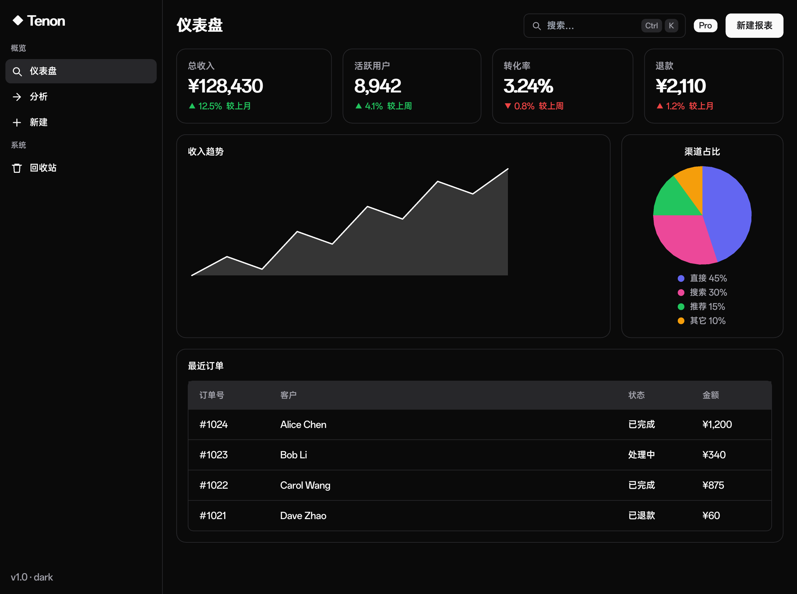

# Tenon

> A declarative, **React-style** GUI toolkit for Go — function components and hooks, on [Yoga](https://www.yogalayout.dev/) flexbox layout and [Ebiten](https://ebiten.org) rendering.

[](https://golang.org)
[](LICENSE)

**English** | [简体中文](README.zh-CN.md)

---



<p align="center"><em>A dashboard built entirely with Tenon + its shadcn-style component library — see <a href="example/showcase">example/showcase</a>.</em></p>

---

## ⚠️ Status

Young but coherent. The core (`pkg/ui`) is stable in shape and covered by tests; APIs may still change before a 1.0. Good for tools, dashboards, in-app/game UIs and prototypes. See [ROADMAP.md](ROADMAP.md) for what's done and what's next. Highlights: rich text (weights/italic, IME, UAX#14 wrapping), on-demand repaint + list virtualization, accessibility (focus trap, arrow-key nav), SVG icons / gradients / rounded clipping, and a ~60-component shadcn library. Not covered: OS-native integration (multi-window, native menus) — bounded by Ebiten.

## What is Tenon?

Tenon brings the React mental model to native Go GUIs:

- **Function components + hooks** — `UseState`, `UseEffect`, `UseReducer`, `UseMemo`, `UseCallback`, `UseRef`, `UseContext`. No classes, no manual invalidation.
- **Automatic, local re-render** — a state setter re-renders only its own component (fiber).
- **HTML-like elements** — `Div`, `Span`, `Button`, `Input`, `Img`, `Text`, `ScrollView`, `Portal`, `Fragment`.
- **Yoga flexbox** for layout, **Ebiten `vector` + `text/v2`** for rendering (antialiased, HiDPI-aware).
- **Batteries included** — animation (tween/transition/FLIP), transforms, drag/hover/keyboard, a base component kit, and a **shadcn/ui-style** library (~41 components).

Internally it's a three-tree design like React: immutable `Node` description → persistent `Fiber` (identity + hooks) → `renderNode` (yoga node + paint). Layout is incremental — paint-only updates don't recompute layout. See [ARCHITECTURE.md](ARCHITECTURE.md).

## Quick start

```bash
go get github.com/sjm1327605995/tenon
```

```go
package main

import (
	"fmt"
	ui "github.com/sjm1327605995/tenon/pkg/ui"
)

func Counter(_ struct{}) *ui.Node {
	count, setCount := ui.UseState(0)
	return ui.Div(
		ui.Style(ui.Row, ui.Gap(16), ui.Padding(24), ui.ItemsCenter),
		ui.Button(ui.OnClick(func() { setCount(count - 1) }), ui.Text("-")),
		ui.Text(fmt.Sprintf("%d", count), ui.FontSize(32)),
		ui.Button(ui.OnClick(func() { setCount(count + 1) }), ui.Text("+")),
	)
}

func main() { ui.Run(ui.Use(Counter, struct{}{})) }
```

## Packages

| Package | What |
|---|---|
| [`pkg/ui`](pkg/ui) | The engine + elements, hooks, styling, animation, input. Start here — see its [README](pkg/ui/README.md). |
| [`pkg/shadcn`](pkg/shadcn) | shadcn/ui-style component library (Button, Card, Dialog, Select, Table, Toast, …) on top of `pkg/ui`. [README](pkg/shadcn/README.md). |
| [`yoga`](yoga) | Pure-Go port of the Yoga flexbox engine. |
| [`pkg/font`](pkg/font) | Font loading/measurement (embeds a CJK-capable face). |

## Examples

Run any with `go run ./example/<name>`:

`hooks-counter` · `hooks-app` (todo) · `hooks-anim` · `hooks-hover` · `hooks-drag` · `hooks-modal` · `hooks-reorder` (FLIP) · `hooks-text` · `hooks-kit` · `hooks-async` (background goroutine + `ui.Post`) · `shadcn-gallery` (full component showcase).

`go run ./example/shadcn-gallery` shows every component with a light/dark toggle.

<!-- Add docs/screenshots/gallery.png (see docs/screenshots/README.md), then uncomment:

-->


## Background updates

Rendering is single-threaded. From a background goroutine, wrap UI updates in `ui.Post`:

```go
go func() {
	data := fetch()
	ui.Post(func() { setData(data) }) // runs on the render goroutine, safe
}()
```

## Contributing

Issues and PRs welcome. Please `gofmt`, keep `go test ./...` green, and match the surrounding style. See [CONTRIBUTING.md](CONTRIBUTING.md).

## License

MIT — see [LICENSE](LICENSE).
