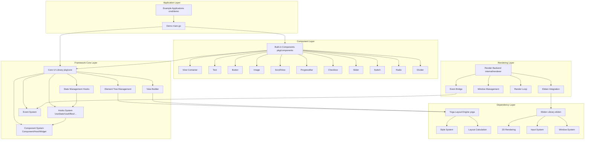

# Tenon - React-like UI Framework for Go

Tenon is a React-like UI framework for Go, combining React's component-based approach with [Ebiten](https://ebitengine.org/)'s high-performance 2D game engine rendering, using the [Yoga](https://www.yogalayout.dev/) layout engine for flexible Flexbox styling. It provides a modern UI development experience for Go developers.

[📖 中文版本](README.zh-CN.md) | [🏠 Homepage](https://github.com/sjm1327605995/tenon)

## 📋 Core Features

- **React-like Component System**: Supports functional components via Widgets with lifecycle hooks
- **Declarative UI**: Build views using a fluent chained API
- **Yoga Layout Engine**: Full Flexbox layout support
- **State Management**: Built-in `UseState` Hook for component state management
- **Rich Hooks**: `UseState`, `UseEffect`, `UseMemo`, `UseRef`, `UseCallback`, `UseId`, `UseContext`, `UseTransition`
- **Ebiten Rendering**: High-performance rendering based on the Ebiten 2D game engine
- **Event Handling**: Support for click, scroll, mouse down/up, and keyboard events (with focus system placeholder)
- **Font Management**: Built-in font manager with support for custom font loading
- **Portal / Overlay**: Support for overlay layers

## 🏗️ Architecture Design


```mermaid
flowchart TD
    subgraph Application Layer
        A[Example Applications cmd/demo]
        A1[Demo main.go]
    end

    subgraph Framework Core Layer
        B[Core UI Library pkg/core]
        B1[Component System Component/Host/Widget]
        B2[State Management Hooks]
        B3[Hooks System UseState/UseEffect/...]
        B4[Element Tree Management]
        B5[View Builder]
        B6[Event System]
    end

    subgraph Component Layer
        C[Built-in Components pkg/components]
        C1[View Container]
        C2[Text]
        C3[Button]
        C4[Image]
    C5[ScrollView]
    C6[ProgressBar]
    C7[Checkbox]
    C8[Slider]
    C9[Switch]
    C10[Radio]
    C11[Divider]
    end

    subgraph Rendering Layer
        D[Render Backend internal/renderer]
        D1[Ebiten Integration]
        D2[Window Management]
        D3[Render Loop]
        D4[Event Bridge]
    end

    subgraph Dependency Layer
        E[Yoga Layout Engine yoga]
        E1[Style System]
        E2[Layout Calculation]
        F[Ebiten Library ebiten]
        F1[2D Rendering]
        F2[Input System]
        F3[Window System]
    end

    A --> A1
    A1 --> B
    A1 --> C

    B --> B1
    B --> B2
    B --> B3
    B --> B4
    B --> B5
    B --> B6
    B2 --> B3
    B3 --> B1

    C --> C1
    C --> C2
    C --> C3
    C --> C4
    C --> C5
    C --> C6
    C --> C7
    C --> C8
    C --> C9
    C --> C10
    C --> C11
    C --> B

    D --> D1
    D --> D2
    D --> D3
    D --> D4
    D1 --> F
    D4 --> B6

    B4 --> E
    B5 --> E
    E --> E1
    E --> E2

    F --> F1
    F --> F2
    F --> F3
```

## 🚀 Quick Start

### Installation

```bash
go get github.com/sjm1327605995/tenon
```

### Running Example

```bash
go run cmd/demo/main.go
```

## 📚 Core Features

### 1. Component System

Tenon has two types of components:

- **Host Components**: Native UI elements (`View`, `Text`, `Button`, `Image`) that handle layout, drawing, and events directly.
- **Widget Components**: User-defined components that describe UI through `Render()` and manage logic via Hooks and lifecycle methods.

```go
type Counter struct {
    tenon.BaseWidget
    count int
}

func NewCounter() *Counter {
    c := &Counter{count: 0}
    c.Init(c)
    return c
}

func (c *Counter) Render() tenon.Component {
    return components.NewView().
        SetPadding(yoga.EdgeAll, 20).
        SetBackgroundColor(color.White).
        SetBorderRadius(12).
        Add(
            components.NewText(fmt.Sprintf("Count: %d", c.count)).SetFontSize(18),
            components.NewButton("+1").SetOnClick(func() {
                c.count++
                c.Invalidate()
            }),
        )
}
```

### 2. Hooks System

All Hooks are methods on `BaseWidget`:

| Hook | Description |
|------|-------------|
| `UseState(initial)` | Manage component state |
| `UseEffect(effect, deps)` | Run side effects on mount and dependency changes |
| `UseMemo(fn, deps)` | Cache computed values |
| `UseRef(initial)` | Mutable reference that persists across renders |
| `UseCallback(fn, deps)` | Cache function references |
| `UseId()` | Generate a unique ID string |
| `UseContext(ctx)` | Read a context value |
| `UseTransition()` | Returns a transition state flag and start function (simplified) |

```go
func (h *MyWidget) Render() tenon.Component {
    count, setCount := h.UseState(0)
    doubled := h.UseMemo(func() any {
        return count.(int) * 2
    }, []any{count})

    h.UseEffect(func() func() {
        fmt.Println("Count changed:", count)
        return func() { fmt.Println("Cleanup") }
    }, []any{count})

    ref := h.UseRef("initial")
    id := h.UseId()

    // ... build UI
}
```

### 3. Lifecycle Methods

Widgets can implement lifecycle hooks:

- `ComponentDidMount()` — Called after the component is first mounted
- `ComponentWillUnmount()` — Called before the component is unmounted
- `ComponentDidUpdate(prevProps, prevState)` — Called after the component updates
- `ShouldComponentUpdate(nextProps)` — Return `false` to skip re-rendering

### 4. View Construction

Build views using a fluent chained API:

```go
view := components.NewView().
    SetWidth(800).
    SetHeight(600).
    SetFlexDirection(yoga.FlexDirectionColumn).
    SetPadding(yoga.EdgeAll, 20).
    SetBackgroundColor(color.RGBA{R: 240, G: 240, B: 240, A: 255}).
    Add(
        components.NewText("Hello, Tenon!").SetFontSize(24),
        components.NewButton("Click Me").SetOnClick(func() {
            fmt.Println("Clicked!")
        }),
    )
```

## 🧩 Built-in Components

### View

The basic container component supporting layout, background, border, shadow, and rounded corners.

```go
v := components.NewView().
    SetWidth(200).
    SetHeight(100).
    SetBackgroundColor(color.White).
    SetBorderRadius(8).
    SetBorder(yoga.EdgeAll, 1).
    SetBorderColor(color.Black).
    SetShadow(color.RGBA{A: 64}, 10, 0, 4).
    SetFlexDirection(yoga.FlexDirectionRow).
    SetJustifyContent(yoga.JustifyCenter).
    SetAlignItems(yoga.AlignCenter)
```

### Text

Text component with automatic measurement, font support, and multi-line wrapping.

```go
t := components.NewText("Hello World").
    SetFontSize(16).
    SetColor(color.Black).
    SetFontFamily(fonts.FontFamilySans).
    SetFontWeight(fonts.FontWeightBold)
```

**Text Wrapping Strategies** (consistent with browser CSS):

| Strategy | Description |
|----------|-------------|
| `WhiteSpaceNormal` | Collapse whitespace, auto wrap (default) |
| `WhiteSpaceNoWrap` | Collapse whitespace, no wrap |
| `WhiteSpacePre` | Preserve whitespace, no wrap |
| `WhiteSpacePreWrap` | Preserve whitespace, auto wrap |
| `WhiteSpacePreLine` | Collapse whitespace (keep newlines), auto wrap |

```go
// Auto wrap with fixed width
t := components.NewText(longText).
    SetWidth(300).
    SetWhiteSpace(components.WhiteSpaceNormal)

// Preserve line breaks
t := components.NewText("Line 1\nLine 2").
    SetWhiteSpace(components.WhiteSpacePreWrap)
```

**Word Break Strategies:**

| Strategy | Description |
|----------|-------------|
| `WordBreakNormal` | CJK characters can break, English wraps by word (default) |
| `WordBreakBreakAll` | All characters can break at any position |
| `WordBreakKeepAll` | Words are kept intact |

```go
t := components.NewText(longText).
    SetWidth(200).
    SetWordBreak(components.WordBreakBreakAll)
```

### Button

Interactive button component with hover/pressed states.

```go
b := components.NewButton("Submit").
    SetWidth(120).
    SetHeight(40).
    SetOnClick(func() {
        fmt.Println("Button clicked")
    }).
    SetBackgroundColors(normal, hover, pressed).
    SetDisabled(false)
```

### Image

Image component (supports setting an Ebiten image directly).

```go
img := components.NewImage().
    SetSource("assets/logo.png").
    SetEbitenImage(ebitenImg)
```

### ScrollView

Scrollable container component supporting mouse wheel and drag scrolling.

```go
sv := components.NewScrollView().
    SetWidth(400).
    SetHeight(300).
    SetBackgroundColor(color.White).
    SetBorderRadius(8)

// Add content to the inner content view
sv.Content().SetFlexDirection(yoga.FlexDirectionColumn).Add(
    components.NewText("Item 1"),
    components.NewText("Item 2"),
    // ... more items
)
```

### ProgressBar

Progress bar component.

```go
pb := components.NewProgressBar().
    SetProgress(0.75).
    SetWidth(300).
    SetHeight(10).
    SetFillColor(color.RGBA{R: 0, G: 123, B: 255, A: 255}).
    SetTrackColor(color.RGBA{R: 224, G: 224, B: 224, A: 255})
```

### Checkbox

Checkbox component with label.

```go
cb := components.NewCheckbox("Enable Feature").
    SetChecked(true).
    SetOnChange(func(checked bool) {
        fmt.Println("Checked:", checked)
    })
```

### Slider

Interactive slider component supporting drag and click.

```go
s := components.NewSlider(0, 100).
    SetValue(50).
    SetWidth(200).
    SetOnChange(func(v float32) {
        fmt.Println("Value:", v)
    })
```

### Switch

Toggle switch component.

```go
sw := components.NewSwitch().
    SetChecked(true).
    SetOnChange(func(on bool) {
        fmt.Println("Switch:", on)
    })
```

### Radio

Radio button component with label.

```go
r := components.NewRadio("Option A").
    SetSelected(true).
    SetOnChange(func(selected bool) {
        fmt.Println("Selected:", selected)
    })
```

### Divider

Horizontal divider line.

```go
d := components.NewDivider().
    SetColor(color.RGBA{R: 200, G: 200, B: 200, A: 255}).
    SetThickness(1)
```

### TextInput

Single-line / multi-line text input box with cursor, selection, and keyboard support.

```go
input := components.NewTextInput().
    SetWidth(300).
    SetPlaceholder("Enter text...").
    SetOnChange(func(text string) {
        fmt.Println("Text:", text)
    }).
    SetOnSubmit(func(text string) {
        fmt.Println("Submit:", text)
    })
```

**Supported keyboard operations:**
- Character input (including CJK)
- `Backspace` / `Delete` — delete characters (supports long-press repeat)
- `←` / `→` — move cursor (supports long-press repeat)
- `Shift + ←/→` — select text
- `Ctrl + A` — select all
- `Home` / `End` — jump to beginning/end
- `Enter` — submit (single-line) or newline (multi-line)

## 📁 Project Structure

```
tenon/
├── cmd/
│   └── demo/
│       └── main.go           # Example application
├── internal/
│   └── renderer/
│       └── ebiten.go         # Ebiten render backend
├── pkg/
│   ├── components/           # Built-in UI components
│   │   ├── view.go           # Container component
│   │   ├── text.go           # Text component
│   │   ├── button.go         # Button component
│   │   ├── image.go          # Image component
│   │   ├── scroll_view.go    # ScrollView component
│   │   ├── progress_bar.go   # ProgressBar component
│   │   ├── checkbox.go       # Checkbox component
│   │   ├── slider.go         # Slider component
│   │   ├── switch.go         # Switch component
│   │   ├── radio.go          # Radio component
│   │   ├── divider.go        # Divider component
│   │   └── text_input.go     # TextInput component
│   ├── core/                 # Core framework
│   │   ├── component.go      # Component/Widget/Host interfaces
│   │   ├── base_host.go      # BaseHost default implementation
│   │   ├── widget.go         # BaseWidget + Hooks
│   │   ├── element.go        # Element + LayoutBounds
│   │   ├── engine.go         # Engine (mount/update/render/event)
│   │   └── event.go          # Event types and structures
│   ├── fonts/                # Font management
│   │   ├── font_manager.go   # Font manager
│   │   └── init.go           # Font initialization helpers
│   └── react/                # Reserved for future React compatibility layer
├── yoga/                     # Yoga layout engine (Go port)
├── font/
│   └── OPPOSans-Medium.ttf   # Default font file
├── tenon.go                  # Public API exports
├── go.mod
├── README.md
└── README.zh-CN.md
```

## 🔤 Font Management

Tenon has a built-in font manager supporting multiple font families and weights:

```go
// Initialize default font
fonts.InitDefaultFont()

// Load custom font from file
fonts.LoadFontFromFile(fonts.FontFamilySans, "font/OPPOSans-Medium.ttf")
fonts.SetDefaultFontFamily(fonts.FontFamilySans)

// Use in components
components.NewText("Hello").SetFontFamily(fonts.FontFamilySans).SetFontWeight(fonts.FontWeightBold)
```

Supported font families: `FontFamilyDefault`, `FontFamilySans`, `FontFamilySerif`, `FontFamilyMono`.
Supported font weights: `FontWeightLight`, `FontWeightNormal`, `FontWeightBold`.

## 🎯 Event System

The engine currently supports:

- `EventClick` — Mouse click
- `EventMouseDown` — Mouse button pressed
- `EventMouseUp` — Mouse button released
- `EventScroll` — Mouse wheel scroll
- `EventMouseMove` — Mouse movement (infrastructure ready)
- `EventKeyDown` / `EventKeyUp` — Keyboard events (dispatched to focused component)
- `EventFocusIn` / `EventFocusOut` — Focus change events

Events bubble up from the target component until a component consumes the event (`HandleEvent` returns `true`).

### Focus System

Components can receive keyboard focus:

- Click a focusable component to set focus
- Press `Tab` to move focus to the next component, `Shift+Tab` to move backward
- Press `Space` or `Enter` on a focused component to trigger a click
- Components call `SetFocusable(true)` to enable focus (e.g., `Button`, `Checkbox`, `ScrollView`)

## 📝 Notes

- **Host Reuse**: When a Widget re-renders, if the returned Host is the same type as before, the framework automatically reuses the old Host instance and syncs properties (styles, Yoga layout, and component-specific fields). This avoids Yoga node recreation and layout jitter. You can freely create new Host instances in `Render()` — no manual caching needed.
- **Stateful Components**: Components with internal state that should persist across renders (e.g. `TextInput` with typed text, `ScrollView` with scroll position) should still be cached as Widget fields and reused in `Render()`.
- **Invalidate**: Call `Invalidate()` to trigger a re-render of the Widget.

## 📄 License

This project is licensed under the MIT License - see the [LICENSE](LICENSE) file for details.

## 📞 Contact

For questions or suggestions, please submit Issues or Pull Requests.

---

**Tenon** - Making Go UI development simpler and more efficient! 🎉
