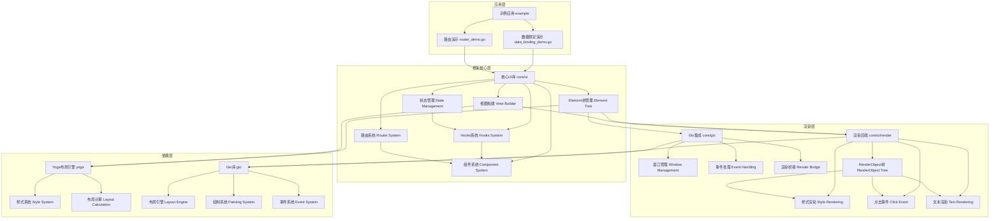

# Tenon - 基于Go的React-like UI框架

Tenon是一个基于Go语言的React-like UI框架，结合了React的组件化思想和Gio的高性能渲染，使用Yoga布局引擎实现灵活的样式系统，为Go开发者提供现代化的UI开发体验。

[📖 English Version](README.md) | [🏠 主页](https://github.com/sjm1327605995/tenon)

## 📋 核心特性

- **React-like组件系统**：支持函数组件和Hooks
- **声明式UI**：使用链式API构建视图
- **Yoga布局引擎**：支持Flexbox和Grid布局
- **状态管理**：内置`useState` Hook，支持组件状态管理
- **路由系统**：实现多页面应用支持
- **Gio渲染**：基于Gio库实现高性能渲染
- **事件处理**：支持点击等用户交互

## 🏗️ 架构设计



## 🚀 快速开始

### 安装

```bash
go get github.com/sjm1327605995/tenon
```

### 运行示例

```bash
# 运行数据绑定示例
go run example/data_binding_demo.go

# 运行路由示例
go run example/router_demo.go
```

## 📚 核心功能

### 1. 组件系统

```go
// 定义组件属性
type CounterProps struct {
    InitialCount int
}

// 创建函数组件
func Counter(props CounterProps) ui.UI {
    // 使用useState Hook
    count, setCount := ui.UseState(props.InitialCount)
    
    return ui.View(
        ui.Text().Content(fmt.Sprintf("Count: %d", count)),
        ui.View(
            ui.Text().Content("+"),
        ).Background(color.NRGBA{G: 255, A: 255}).OnClick(func() {
            setCount(count + 1)
        }),
    )
}
```

### 2. Hooks系统

- `useState`：管理组件状态
- `useNavigate`：实现编程式导航

### 3. 路由系统

```go
// 定义路由
routes := []ui.RouteProps{
    {Path: "/", Component: Counter, Props: CounterProps{InitialCount: 0}},
    {Path: "/about", Component: AboutPage, Props: AboutPageProps{}},
}

// 创建路由管理器
router := ui.NewRouter(routes)
```

### 4. 视图构建

```go
// 使用链式API构建视图
view := ui.View(
    ui.Text().Content("Hello, Tenon!").FontSize(24),
    ui.View(
        ui.Text().Content("Subview 1"),
        ui.Text().Content("Subview 2"),
    ).FlexDirection(yoga.FlexDirectionRow),
).
    Width(ui.Percent(100)).
    Height(ui.Percent(100)).
    Background(color.NRGBA{B: 255, A: 128})
```

## 📁 项目结构

```
tenon/
├── core/
│   ├── gio/          # Gio集成
│   │   └── app.go    # 应用启动和窗口管理
│   └── ui/           # 核心UI库
│       ├── binding.go # 组件和Hooks系统
│       ├── element.go # Element树管理
│       ├── ui.go      # 视图构建API
│       └── render/    # 渲染后端
│           ├── click_able.go  # 点击事件处理
│           ├── render.go       # 渲染基类
│           ├── text.go         # 文本渲染
│           └── tree.go         # RenderObject树
├── example/          # 示例应用
│   └── data_binding_demo.go # 数据绑定示例
└── yoga/             # Yoga布局引擎
    ├── enum.go       # 枚举定义
    └── style.go      # 样式系统
```

## 📖 使用指南

### 创建组件

1. 定义组件属性结构
2. 创建函数组件，接收属性并返回UI
3. 在组件内部使用Hooks管理状态
4. 使用链式API构建视图

### 使用Hooks

```go
// 状态管理
count, setCount := ui.UseState(0)

// 导航
navigate := ui.UseNavigate()
navigate("/about")
```

### 配置路由

1. 定义路由配置，映射路径到组件
2. 创建路由管理器
3. 在组件中使用`useNavigate`进行导航

## 🤝 贡献指南

1. Fork 本仓库
2. 创建特性分支 (`git checkout -b feature/AmazingFeature`)
3. 提交更改 (`git commit -m 'Add some AmazingFeature'`)
4. 推送到分支 (`git push origin feature/AmazingFeature`)
5. 打开 Pull Request

## 📄 许可证

本项目采用 MIT 许可证 - 查看 [LICENSE](LICENSE) 文件了解详情

## 📞 联系方式

如有问题或建议，欢迎提交 Issue 或 Pull Request。

---

**Tenon** - 让Go UI开发更简单、更高效！ 🎉