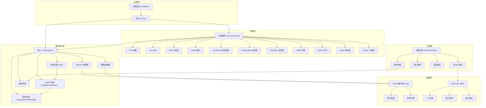

# Tenon - 基于 Go 的 React-like UI 框架

Tenon 是一个基于 Go 语言的 React-like UI 框架，结合了 React 的组件化思想和 [Ebiten](https://ebitengine.org/) 高性能 2D 游戏引擎的渲染能力，使用 [Yoga](https://www.yogalayout.dev/) 布局引擎实现灵活的 Flexbox 样式系统，为 Go 开发者提供现代化的 UI 开发体验。

[📖 English Version](README.md) | [🏠 主页](https://github.com/sjm1327605995/tenon)

## 📋 核心特性

- **React-like 组件系统**：通过 Widget 支持函数式组件和生命周期钩子
- **声明式 UI**：使用流式链式 API 构建视图
- **Yoga 布局引擎**：完整的 Flexbox 布局支持
- **状态管理**：内置 `UseState` Hook 管理组件状态
- **丰富的 Hooks**：`UseState`、`UseEffect`、`UseMemo`、`UseRef`、`UseCallback`、`UseId`、`UseContext`、`UseTransition`
- **Ebiten 渲染**：基于 Ebiten 2D 游戏引擎的高性能渲染
- **事件处理**：支持点击、滚动、鼠标按下/抬起、键盘事件（焦点系统预留）
- **字体管理**：内置字体管理器，支持自定义字体加载
- **浮层/Portal**：支持 overlay 层挂载

## 🏗️ 架构设计


```mermaid
flowchart TD
    subgraph 应用层
        A[示例应用 cmd/demo]
        A1[演示 main.go]
    end

    subgraph 框架核心层
        B[核心 UI 库 pkg/core]
        B1[组件系统 Component/Host/Widget]
        B2[状态管理 Hooks]
        B3[Hooks 系统 UseState/UseEffect/...]
        B4[Element 树管理]
        B5[视图构建器]
        B6[事件系统]
    end

    subgraph 组件层
        C[内置组件 pkg/components]
        C1[View 容器]
        C2[Text 文本]
        C3[Button 按钮]
        C4[Image 图片]
    C5[ScrollView 滚动视图]
    C6[ProgressBar 进度条]
    C7[Checkbox 复选框]
    C8[Slider 滑块]
    C9[Switch 开关]
    C10[Radio 单选框]
    C11[Divider 分割线]
    end

    subgraph 渲染层
        D[渲染后端 internal/renderer]
        D1[Ebiten 集成]
        D2[窗口管理]
        D3[渲染循环]
        D4[事件桥接]
    end

    subgraph 依赖层
        E[Yoga 布局引擎 yoga]
        E1[样式系统]
        E2[布局计算]
        F[Ebiten 库 ebiten]
        F1[2D 渲染]
        F2[输入系统]
        F3[窗口系统]
    end

    A --> A1
    A1 --> B
    A1 --> C

    B --> B1
    B --> B2
    B --> B3
    B --> B4
    B --> B5
    B --> B6
    B2 --> B3
    B3 --> B1

    C --> C1
    C --> C2
    C --> C3
    C --> C4
    C --> C5
    C --> C6
    C --> C7
    C --> C8
    C --> C9
    C --> C10
    C --> C11
    C --> B

    D --> D1
    D --> D2
    D --> D3
    D --> D4
    D1 --> F
    D4 --> B6

    B4 --> E
    B5 --> E
    E --> E1
    E --> E2

    F --> F1
    F --> F2
    F --> F3
```

## 🚀 快速开始

### 安装

```bash
go get github.com/sjm1327605995/tenon
```

### 运行示例

```bash
go run cmd/demo/main.go
```

## 📚 核心功能

### 1. 组件系统

Tenon 有两种组件：

- **Host 组件**：原生 UI 元素（`View`、`Text`、`Button`、`Image`），直接处理布局、绘制和交互。
- **Widget 组件**：用户自定义组件，通过 `Render()` 描述 UI，通过 Hooks 和生命周期方法管理逻辑。

```go
type Counter struct {
    tenon.BaseWidget
    count int
}

func NewCounter() *Counter {
    c := &Counter{count: 0}
    c.Init(c)
    return c
}

func (c *Counter) Render() tenon.Component {
    return components.NewView().
        SetPadding(yoga.EdgeAll, 20).
        SetBackgroundColor(color.White).
        SetBorderRadius(12).
        Add(
            components.NewText(fmt.Sprintf("Count: %d", c.count)).SetFontSize(18),
            components.NewButton("+1").SetOnClick(func() {
                c.count++
                c.Invalidate()
            }),
        )
}
```

### 2. Hooks 系统

所有 Hooks 都是 `BaseWidget` 的方法：

| Hook | 说明 |
|------|------|
| `UseState(initial)` | 管理组件状态 |
| `UseEffect(effect, deps)` | 在挂载和依赖变化时执行副作用 |
| `UseMemo(fn, deps)` | 缓存计算结果 |
| `UseRef(initial)` | 跨渲染持久化的可变引用 |
| `UseCallback(fn, deps)` | 缓存函数引用 |
| `UseId()` | 生成唯一 ID 字符串 |
| `UseContext(ctx)` | 读取上下文值 |
| `UseTransition()` | 返回过渡状态标记和启动函数（简化实现） |

```go
func (h *MyWidget) Render() tenon.Component {
    count, setCount := h.UseState(0)
    doubled := h.UseMemo(func() any {
        return count.(int) * 2
    }, []any{count})

    h.UseEffect(func() func() {
        fmt.Println("Count changed:", count)
        return func() { fmt.Println("Cleanup") }
    }, []any{count})

    ref := h.UseRef("initial")
    id := h.UseId()

    // ... 构建 UI
}
```

### 3. 生命周期方法

Widget 可以实现生命周期钩子：

- `ComponentDidMount()` — 组件首次挂载后调用
- `ComponentWillUnmount()` — 组件卸载前调用
- `ComponentDidUpdate(prevProps, prevState)` — 组件更新后调用
- `ShouldComponentUpdate(nextProps)` — 返回 `false` 可跳过重新渲染

### 4. 视图构建

使用流式链式 API 构建视图：

```go
view := components.NewView().
    SetWidth(800).
    SetHeight(600).
    SetFlexDirection(yoga.FlexDirectionColumn).
    SetPadding(yoga.EdgeAll, 20).
    SetBackgroundColor(color.RGBA{R: 240, G: 240, B: 240, A: 255}).
    Add(
        components.NewText("Hello, Tenon!").SetFontSize(24),
        components.NewButton("Click Me").SetOnClick(func() {
            fmt.Println("Clicked!")
        }),
    )
```

## 🧩 内置组件

### View

基础容器组件，支持布局、背景、边框、阴影和圆角。

```go
v := components.NewView().
    SetWidth(200).
    SetHeight(100).
    SetBackgroundColor(color.White).
    SetBorderRadius(8).
    SetBorder(yoga.EdgeAll, 1).
    SetBorderColor(color.Black).
    SetShadow(color.RGBA{A: 64}, 10, 0, 4).
    SetFlexDirection(yoga.FlexDirectionRow).
    SetJustifyContent(yoga.JustifyCenter).
    SetAlignItems(yoga.AlignCenter)
```

### Text

文本组件，支持自动测量、字体设置和多行文本换行。

```go
t := components.NewText("Hello World").
    SetFontSize(16).
    SetColor(color.Black).
    SetFontFamily(fonts.FontFamilySans).
    SetFontWeight(fonts.FontWeightBold)
```

**文本换行策略**（与浏览器 CSS 一致）：

| 策略 | 说明 |
|------|------|
| `WhiteSpaceNormal` | 合并空白，自动换行（默认） |
| `WhiteSpaceNoWrap` | 合并空白，不换行 |
| `WhiteSpacePre` | 保留空白，不换行 |
| `WhiteSpacePreWrap` | 保留空白，自动换行 |
| `WhiteSpacePreLine` | 合并空白（保留换行），自动换行 |

```go
// 固定宽度自动换行
t := components.NewText(longText).
    SetWidth(300).
    SetWhiteSpace(components.WhiteSpaceNormal)

// 保留换行符
t := components.NewText("Line 1\nLine 2").
    SetWhiteSpace(components.WhiteSpacePreWrap)
```

**断词策略：**

| 策略 | 说明 |
|------|------|
| `WordBreakNormal` | CJK 字符可断行，英文按词换行（默认） |
| `WordBreakBreakAll` | 所有字符可在任意位置断行 |
| `WordBreakKeepAll` | 保持词完整 |

```go
t := components.NewText(longText).
    SetWidth(200).
    SetWordBreak(components.WordBreakBreakAll)
```

### Button

交互按钮组件，支持悬停/按下状态。

```go
b := components.NewButton("Submit").
    SetWidth(120).
    SetHeight(40).
    SetOnClick(func() {
        fmt.Println("Button clicked")
    }).
    SetBackgroundColors(normal, hover, pressed).
    SetDisabled(false)
```

### Image

图片组件（支持直接设置 Ebiten 图片）。

```go
img := components.NewImage().
    SetSource("assets/logo.png").
    SetEbitenImage(ebitenImg)
```

### ScrollView

可滚动容器组件，支持鼠标滚轮和拖拽滚动。

```go
sv := components.NewScrollView().
    SetWidth(400).
    SetHeight(300).
    SetBackgroundColor(color.White).
    SetBorderRadius(8)

// 向内层内容视图添加子组件
sv.Content().SetFlexDirection(yoga.FlexDirectionColumn).Add(
    components.NewText("Item 1"),
    components.NewText("Item 2"),
    // ... 更多项
)
```

### ProgressBar

进度条组件。

```go
pb := components.NewProgressBar().
    SetProgress(0.75).
    SetWidth(300).
    SetHeight(10).
    SetFillColor(color.RGBA{R: 0, G: 123, B: 255, A: 255}).
    SetTrackColor(color.RGBA{R: 224, G: 224, B: 224, A: 255})
```

### Checkbox

带标签的复选框组件。

```go
cb := components.NewCheckbox("Enable Feature").
    SetChecked(true).
    SetOnChange(func(checked bool) {
        fmt.Println("Checked:", checked)
    })
```

### Slider

支持拖拽和点击的交互式滑块组件。

```go
s := components.NewSlider(0, 100).
    SetValue(50).
    SetWidth(200).
    SetOnChange(func(v float32) {
        fmt.Println("Value:", v)
    })
```

### Switch

开关切换组件。

```go
sw := components.NewSwitch().
    SetChecked(true).
    SetOnChange(func(on bool) {
        fmt.Println("Switch:", on)
    })
```

### Radio

带标签的单选框组件。

```go
r := components.NewRadio("Option A").
    SetSelected(true).
    SetOnChange(func(selected bool) {
        fmt.Println("Selected:", selected)
    })
```

### Divider

水平分割线组件。

```go
d := components.NewDivider().
    SetColor(color.RGBA{R: 200, G: 200, B: 200, A: 255}).
    SetThickness(1)
```

### TextInput

单行/多行文本输入框，支持光标、选区和键盘输入。

```go
input := components.NewTextInput().
    SetWidth(300).
    SetPlaceholder("Enter text...").
    SetOnChange(func(text string) {
        fmt.Println("Text:", text)
    }).
    SetOnSubmit(func(text string) {
        fmt.Println("Submit:", text)
    })
```

**支持的键盘操作：**
- 字符输入（包括中文）
- `Backspace` / `Delete` — 删除字符（支持长按重复）
- `←` / `→` — 移动光标（支持长按重复）
- `Shift + ←/→` — 选中文本
- `Ctrl + A` — 全选
- `Home` / `End` — 跳到开头/结尾
- `Enter` — 提交（单行）或换行（多行）

## 📁 项目结构

```
tenon/
├── cmd/
│   └── demo/
│       └── main.go           # 示例应用
├── internal/
│   └── renderer/
│       └── ebiten.go         # Ebiten 渲染后端
├── pkg/
│   ├── components/           # 内置 UI 组件
│   │   ├── view.go           # 容器组件
│   │   ├── text.go           # 文本组件
│   │   ├── button.go         # 按钮组件
│   │   ├── image.go          # 图片组件
│   │   ├── scroll_view.go    # 滚动视图组件
│   │   ├── progress_bar.go   # 进度条组件
│   │   ├── checkbox.go       # 复选框组件
│   │   ├── slider.go         # 滑块组件
│   │   ├── switch.go         # 开关组件
│   │   ├── radio.go          # 单选框组件
│   │   ├── divider.go        # 分割线组件
│   │   └── text_input.go     # 文本输入框组件
│   ├── core/                 # 框架核心
│   │   ├── component.go      # Component/Widget/Host 接口
│   │   ├── base_host.go      # BaseHost 默认实现
│   │   ├── widget.go         # BaseWidget + Hooks
│   │   ├── element.go        # Element + LayoutBounds
│   │   ├── engine.go         # 引擎（挂载/更新/渲染/事件）
│   │   └── event.go          # 事件类型和结构
│   ├── fonts/                # 字体管理
│   │   ├── font_manager.go   # 字体管理器
│   │   └── init.go           # 字体初始化辅助
│   └── react/                # 预留 React 兼容层
├── yoga/                     # Yoga 布局引擎（Go 移植版）
├── font/
│   └── OPPOSans-Medium.ttf   # 默认字体文件
├── tenon.go                  # 公共 API 导出
├── go.mod
├── README.md
└── README.zh-CN.md
```

## 🔤 字体管理

Tenon 内置字体管理器，支持多字体族和多字重：

```go
// 初始化默认字体
fonts.InitDefaultFont()

// 从文件加载自定义字体
fonts.LoadFontFromFile(fonts.FontFamilySans, "font/OPPOSans-Medium.ttf")
fonts.SetDefaultFontFamily(fonts.FontFamilySans)

// 在组件中使用
components.NewText("Hello").SetFontFamily(fonts.FontFamilySans).SetFontWeight(fonts.FontWeightBold)
```

支持的字体族：`FontFamilyDefault`、`FontFamilySans`、`FontFamilySerif`、`FontFamilyMono`。
支持的字重：`FontWeightLight`、`FontWeightNormal`、`FontWeightBold`。

## 🎯 事件系统

引擎目前支持的事件：

- `EventClick` — 鼠标点击
- `EventMouseDown` — 鼠标按下
- `EventMouseUp` — 鼠标抬起
- `EventScroll` — 鼠标滚轮滚动
- `EventMouseMove` — 鼠标移动（基础设施就绪）
- `EventKeyDown` / `EventKeyUp` — 键盘事件（分发给焦点组件）
- `EventFocusIn` / `EventFocusOut` — 焦点变化事件

事件从目标组件向上冒泡，直到某个组件消费事件（`HandleEvent` 返回 `true`）。

### 焦点系统

组件可以接收键盘焦点：

- 点击可焦点组件即可设置焦点
- 按 `Tab` 键将焦点移到下一个组件，`Shift+Tab` 反向移动
- 在焦点组件上按 `Space` 或 `Enter` 可触发点击
- 组件调用 `SetFocusable(true)` 开启焦点（如 `Button`、`Checkbox`、`ScrollView`）

## 📝 注意事项

- **Host 自动复用**：Widget 重新渲染时，如果返回的 Host 与之前类型相同，框架会自动复用旧 Host 实例并同步属性（样式、Yoga 布局、组件特有字段），避免 Yoga 节点重建和布局跳动。你可以在 `Render()` 中自由创建新的 Host 实例，无需手动缓存。
- **有状态组件**：对于内部状态需要跨渲染保留的组件（如带输入文本的 `TextInput`、带滚动位置的 `ScrollView`），仍建议作为 Widget 字段缓存并在 `Render()` 中复用。
- **触发更新**：调用 `Invalidate()` 触发 Widget 重新渲染。

## 📄 许可证

本项目采用 MIT 许可证 — 查看 [LICENSE](LICENSE) 文件了解详情。

## 📞 联系方式

如有问题或建议，欢迎提交 Issue 或 Pull Request。

---

**Tenon** - 让 Go UI 开发更简单、更高效！🎉
