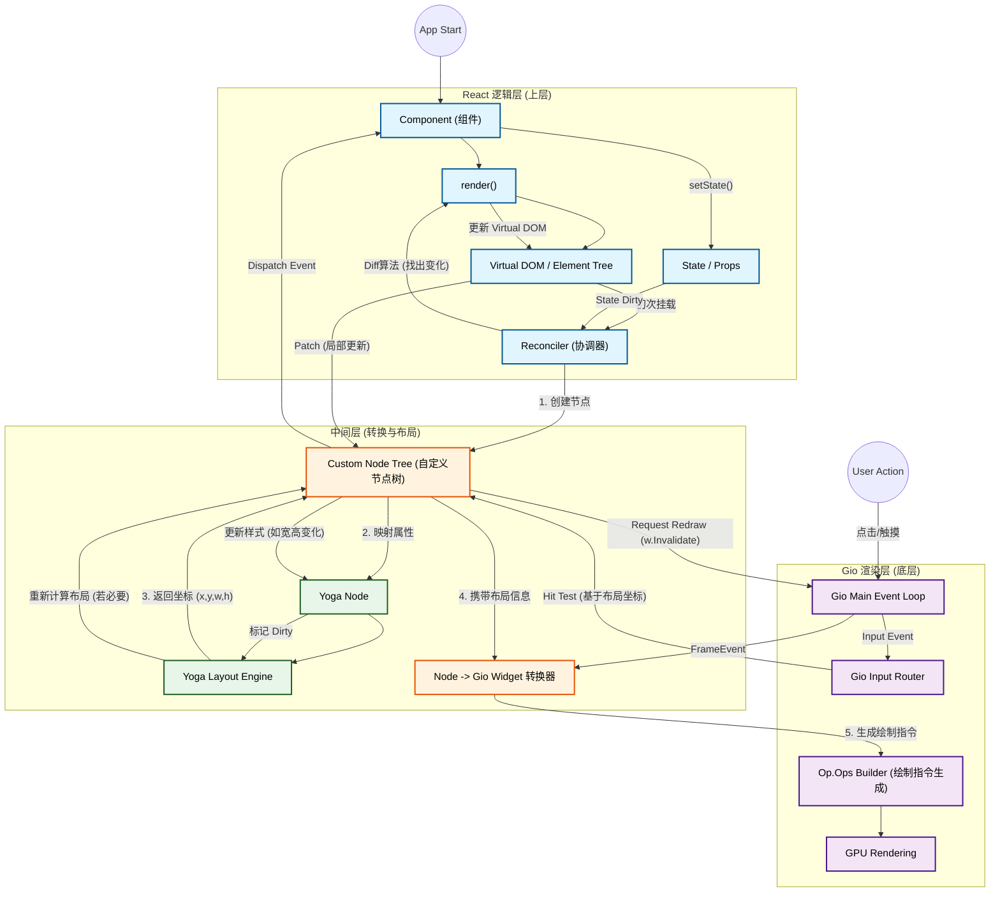

```mermaid
flowchart TD
    %% 定义样式
    classDef react fill:#e1f5fe,stroke:#01579b,stroke-width:2px,color:#000
    classDef mid fill:#fff3e0,stroke:#e65100,stroke-width:2px,color:#000
    classDef yoga fill:#e8f5e9,stroke:#1b5e20,stroke-width:2px,color:#000
    classDef gio fill:#f3e5f5,stroke:#4a148c,stroke-width:2px,color:#000
    classDef event fill:#ffcdd2,stroke:#b71c1c,stroke-width:2px,stroke-dasharray: 5 5,color:#000

    subgraph ReactLayer ["React 逻辑层 (上层)"]
        Component["Component (组件)"]:::react
        State["State / Props"]:::react
        Render["render()"]:::react
        Reconciler["Reconciler (协调器)"]:::react
        VDOM["Virtual DOM / Element Tree"]:::react
    end

    subgraph MiddleLayer ["中间层 (转换与布局)"]
        CustomNode["Custom Node Tree (自定义节点树)"]:::mid
        YogaNode["Yoga Node "]:::yoga
        LayoutEngine["Yoga Layout Engine"]:::yoga
        Transformer["Node -> Gio Widget 转换器"]:::mid
    end

    subgraph GioLayer ["Gio 渲染层 (底层)"]
        GioLoop["Gio Main Event Loop"]:::gio
        InputSystem["Gio Input Router"]:::gio
        OpsBuilder["Op.Ops Builder (绘制指令生成)"]:::gio
        GPU["GPU Rendering"]:::gio
    end

    %% 初始化流程
    Start((App Start)) --> Component
    Component --> Render
    Render --> VDOM
    VDOM -- 初次挂载 --> Reconciler
    Reconciler -- "1. 创建节点" --> CustomNode
    CustomNode -- "2. 映射属性" --> YogaNode
    YogaNode --> LayoutEngine
    LayoutEngine -- "3. 返回坐标 (x,y,w,h)" --> CustomNode
    
    %% 渲染循环
    GioLoop -- "FrameEvent" --> Transformer
    CustomNode -- "4. 携带布局信息" --> Transformer
    Transformer -- "5. 生成绘制指令" --> OpsBuilder
    OpsBuilder --> GPU

    %% 交互与更新流程 (核心逻辑)
    User((User Action)) -- "点击/触摸" --> GioLoop
    GioLoop -- "Input Event" --> InputSystem
    InputSystem -- "Hit Test (基于布局坐标)" --> CustomNode
    CustomNode -- "Dispatch Event" --> Component
    
    Component -- "setState()" --> State
    State -- "State Dirty" --> Reconciler
    
    %% 局部更新逻辑
    Reconciler -- "Diff算法 (找出变化)" --> Render
    Render -- "更新 Virtual DOM" --> VDOM
    VDOM -- "Patch (局部更新)" --> CustomNode
    
    CustomNode -- "更新样式 (如宽高变化)" --> YogaNode
    YogaNode -- "标记 Dirty" --> LayoutEngine
    
    %% 触发重绘
    LayoutEngine -- "重新计算布局 (若必要)" --> CustomNode
    CustomNode -- "Request Redraw (w.Invalidate)" --> GioLoop

```